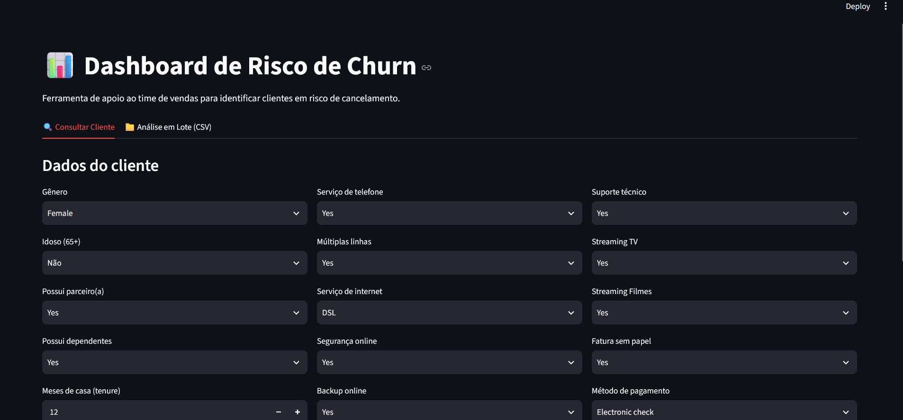
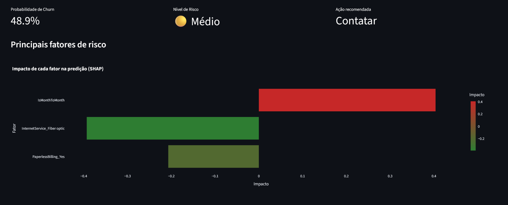

# 📊 Predição de Churn em Telecom

Pipeline completo de Machine Learning para prever o risco de cancelamento (churn) de clientes de telecom, com API própria e dashboard interativo para o time de vendas.

> **Contexto de negócio**: a empresa perde ~25% dos clientes por ano. Reter um cliente custa, em média, **5x menos** do que adquirir um novo. Este projeto identifica clientes com alto risco de cancelamento nos próximos meses, permitindo ações de retenção proativas em vez de reativas.

---

## 🖼️ Demonstração

<!-- Substitua pelos seus prints/GIF reais do dashboard -->



---

## 🏗️ Arquitetura

```
┌─────────────────┐      ┌──────────────────┐      ┌───────────────────┐
│   Dataset IBM     │      │                    │      │                     │
│  Telco Customer   │ ───▶ │   Treino (Colab)   │ ───▶ │   Modelo (.json)    │
│      Churn        │      │  XGBoost + Optuna  │      │  + colunas + thresh │
└─────────────────┘      └──────────────────┘      └──────────┬──────────┘
                                                                  │
                                                                  ▼
                                                       ┌────────────────────┐
                                                       │    API (FastAPI)    │
                                                       │  /predict            │
                                                       │  /predict/batch       │
                                                       │  + explicações SHAP   │
                                                       └──────────┬──────────┘
                                                                  │ HTTP
                                                                  ▼
                                                       ┌────────────────────┐
                                                       │ Dashboard (Streamlit)│
                                                       │  Consulta individual  │
                                                       │  Análise em lote (CSV)│
                                                       └────────────────────┘

           Tudo orquestrado via Docker Compose — um único comando sobe tudo.
```

---

## 🚀 Como rodar

Pré-requisito: [Docker Desktop](https://www.docker.com/products/docker-desktop/) instalado e rodando.

```bash
git clone <https://github.com/Dudsz76/Portf-lio-EduardoAlves-2.0/TelcoChurn>
cd telco-churn
docker-compose up --build
```

Depois de subir:
- **API**: [http://localhost:8000/docs](http://localhost:8000/docs) — documentação interativa (Swagger)
- **Dashboard**: [http://localhost:8501](http://localhost:8501)

Para parar:
```bash
docker-compose down
```

### Rodando sem Docker (ambiente local)

```bash
python -m venv venv
venv\Scripts\activate        # Windows
source venv/bin/activate     # Mac/Linux

pip install -r requirements.txt

# Terminal 1
cd api
uvicorn main:app --reload --port 8000

# Terminal 2
cd dashboard
streamlit run app.py
```

---

## 📁 Estrutura do projeto

```
telco-churn/
├── data/                    # dataset original e processado
├── notebooks/               # EDA, tratamento de dados, treino do modelo
├── models/                  # modelo treinado (.json), colunas e threshold (.pkl)
├── api/                     # FastAPI: main.py, schemas.py, preprocessing.py
├── dashboard/               # Streamlit: app.py
├── tests/                   # testes automatizados (pytest)
├── requirements.txt
├── Dockerfile.api
├── Dockerfile.dashboard
├── docker-compose.yml
└── README.md
```

---

## 🔬 Pipeline de modelagem

### 1. Dados
Dataset **Telco Customer Churn (IBM)**, ~7.043 clientes. Classes desbalanceadas: **73% não-churn vs. 27% churn**.

### 2. Tratamento de dados
- `TotalCharges` veio como texto, com valores vazios em clientes com `tenure = 0` (clientes novos, ainda não cobrados) — tratado com preenchimento por 0, justificado pela causa identificada.
- Remoção de identificador único (`customerID`).

### 3. Feature engineering
Variáveis derivadas com embasamento de negócio:
| Feature | Descrição |
|---|---|
| `NumServices` | Quantidade de serviços contratados |
| `AvgChargePerTenure` | Ticket médio por tempo de casa |
| `IsNewCustomer` | Cliente com ≤ 6 meses de casa |
| `IsMonthToMonth` | Contrato mensal (sem fidelidade) |
| `TenureGroup` | Faixas de tempo de casa |

### 4. Modelagem
- **XGBoost**, com `scale_pos_weight` para compensar o desbalanceamento de classes.
- Avaliação com **AUC-ROC** e **AUC-PR** (mais adequada que acurácia para classes desbalanceadas).
- **Threshold de decisão otimizado por custo de negócio**: em vez do padrão 0.5, o ponto de corte foi escolhido minimizando o custo esperado de Falsos Negativos (cliente perdido) vs. Falsos Positivos (ação de retenção desperdiçada).
- **Otimização de hiperparâmetros** com Optuna (busca bayesiana, validação cruzada 5-fold).

### 5. Explicabilidade
Uso de **SHAP** para interpretar as previsões — tanto no agregado (quais variáveis mais pesam no modelo) quanto por cliente individual (quais fatores específicos explicam o risco daquele cliente). Essa camada de explicabilidade é exposta diretamente na API e no dashboard.

### 6. Resultados
<!-- Preencha com os números reais do seu modelo -->
| Métrica | Valor |
|---|---|
| AUC-ROC | 0.8395 |
| AUC-PR | 0.647 |
| Threshold ótimo | 0.30 |
| Precision (churn) | 0.94 |
| Recall (churn) | 0.60 |

---

## 🔌 API (FastAPI)

| Endpoint | Método | Descrição |
|---|---|---|
| `/health` | GET | Verifica se a API está no ar |
| `/predict` | POST | Previsão para um único cliente, com probabilidade, nível de risco e principais motivos (SHAP) |
| `/predict/batch` | POST | Previsão para uma lista de clientes |

Exemplo de resposta do `/predict`:
```json
{
  "churn_probability": 0.83,
  "risk_level": "Alto",
  "will_churn": true,
  "top_reasons": {
    "IsMonthToMonth": 0.42,
    "tenure": -0.31,
    "InternetService_Fiber optic": 0.28
  }
}
```

## 📊 Dashboard (Streamlit)

- **Consulta individual**: formulário para analisar o risco de um cliente específico, com gráfico de fatores de impacto (SHAP).
- **Análise em lote**: upload de CSV com a carteira de clientes, retornando distribuição de risco e lista priorizada para contato, com exportação em CSV.

---

## 🛠️ Stack

`Python` · `Pandas` · `XGBoost` · `Optuna` · `SHAP` · `FastAPI` · `Streamlit` · `Docker` · `Docker Compose`

---

## ⚠️ Limitações

- O dataset é estático e não reflete sazonalidade real de uma base de clientes.
- Os custos usados na otimização do threshold (`CUSTO_ADQUIRIR`, `CUSTO_RETER`) são ilustrativos — em um cenário real, viriam de dados financeiros da empresa.
- O modelo não é retreinado automaticamente (não há pipeline de retraining/monitoramento de drift nesta versão).

---

## 📌 Próximos passos (possíveis evoluções)

- [ ] Pipeline de retraining automático
- [ ] Monitoramento de drift do modelo em produção
- [ ] Testes automatizados mais abrangentes (cobertura de API e preprocessing)
- [ ] Deploy em nuvem (ex: Streamlit Community Cloud + Render/Railway para a API)

---

## Autor

Desenvolvido por Eduardo Alves de Oliveira como parte de portfólio em Data Science.
[LinkedIn](https://www.linkedin.com/in/eduardo-alves-dados/) · [GitHub](https://github.com/Dudsz76/Portf-lio-EduardoAlves-2.0)
